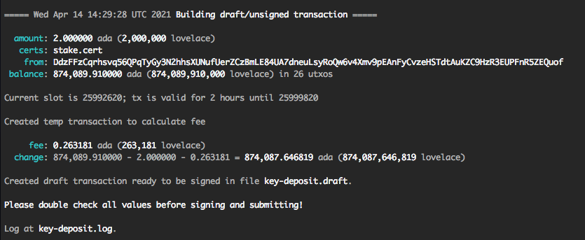

## Transaction Scripts

Creating a transaction with the `cardano-cli` is more complex than it ought to be. We discovered this while following the 
excellent [CoinCashew](https://www.coincashew.com/coins/overview-ada/guide-how-to-build-a-haskell-stakepool-node) steps to 
register our stake pool ([PDT1](https://pdtpools.io/)) and thought that at least some of it could be improved; this is our 
attempt using wrapper scripts. 

> An important goal of ours is to submit a PR to CoinCashew updating the pool registration steps to use these scripts.

As you are likely aware if you've gotten here, drafting, signing and submitting are done separately so that signing can occur 
on an air-gapped machine. While drafting is really the only step that is complex, we've created scripts for each step to be 
consistent, both in usage and logging:

* [draftTx.sh](#drafting-a-transaction)
* [signTx.sh](#signing-a-transaction)
* [submitTx.sh](#submitting-a-transaction)

Each requires use of a `--name` option that is used to name the transaction and log file (the latter will include the actual 
`cardano-cli` commands issued). For example, say you're creating a key deposit transaction and you specify `--name key-deposit` 
in all three steps. The first step would result in `key-deposit.draft` and `key-deposit.log` files. The second would expect the 
`key-deposit.draft` file and produce a `key-deposit.signed` file as well as append to the `key-deposit.log` file. Finally, the 
third would expect the `key-deposit.signed` file and append to the `key-deposit.log` file.

The draft and sign steps have no permanent effect and can even be repeated; however, the submit step is clearly different. To 
enable experimenting with the entire flow, the `submitTx.sh` script supports a `--dry-run` option which will cause it to skip 
the actual submit command but log it anyway.
                                    
To give you an idea of what the draftTx.sh script does, here is example terminal output:



### Example

In this example we'll submit a key-deposit for a new pool. This assumes the following files exist on the specified machines:

* `payment.addr` contains the pool's payment address (block producer)
* `stake.cert` contains the stake certificate (block producer)
* `stake.skey` contains the pool's signing key (air-gapped)
* `payment.skey` contains the pool's signing key (air-gapped)


1. On the block producer node run:
```bash
draftTx.sh --name key-deposit --key-deposit --from $(cat payment.addr) --certificate-file stake.cert
```

2. Copy the `key-deposit.draft` file to the air-gapped machine and on it run:
```bash
signRawTx.sh --name key-deposit --signing-key-file stake.skey --signing-key-file payment.skey
```

3. Copy the `key-deposit.signed` file to the block producer machine and on it run:
```bash
submitTx.sh --name key-deposit
```

Note that in the last step we did *not* use the `--dry-run` option.

### Drafting a Transaction
```
> draftTx.sh --help

Builds a draft transaction file ready to be signed, stored as .draft file.
All output is logged along with executed cardano-cli commands.

Usage: draftTx.sh --name NAME --ada ADA | --lovelace LOVELACE | --key-deposit | --pool-deposit --from ADDRESS

Options:

    --ada ADA                    Specify amount to send in ada.
    --lovelace LOVELACE          Specify amount to send in lovelace.
    --key-deposit                Specify amount to send by looking up key deposit.
    --pool-deposit               Specify amount to send by looking up pool deposit.
    --certificate-file FILE      Add a certificate. May be repeated.
    --to ADDRESS                 Add a destination address where amount should be sent.
    --verbose, -v                Print extra output.

Example: build key-deposit.draft transaction file to send key deposit

draftTx.sh --name key-deposit \
--key-deposit \
--from $(cat payment.addr) \
--certificate-file stake.cert

Example: build pool-deposit.draft transaction file to send pool deposit

draftTx.sh --name pool-deposit \
--pool-deposit \
--from $(cat payment.addr) \
--certificate-file pool.cert \
--certificate-file deleg.cert

Example: build tip.draft transaction file to send 10 ADA tip to CoinCashew

draftTx.sh --name tip \
--lovelace 10000000 \
--from $(cat payment.addr) \
--to addr1qxhazv2dp8yvqwyxxlt7n7ufwhw582uqtcn9llqak736ptfyf8d2zwjceymcq6l5gxht0nx9zwazvtvnn22sl84tgkyq7guw7q

Example: build tx.draft transaction file to send 100 ADA to an address

draftTx.sh --name tx \
--ada 100 \
--from $(cat from.addr) \
--to $(cat to.addr)
```
### Signing a transaction
```
> signTx.sh --help

Signs a draft transaction with one or more keys and stores as .signed file
All output is logged along with executed cardano-cli commands.

Usage: signTx.sh --name NAME --signing-key-file FILE [--signing-key-file FILE]

Example: sign key-deposit.draft transaction file with stake and payment keys

signTx.sh --name key-deposit \
          --signing-key-file stake.skey \
          --signing-key-file payment.skey

Example: sign pool-deposit.draft transaction file with node (pool), stake and payment key.

signTx.sh --name pool-deposit \
          --signing-key-file node.skey \
          --signing-key-file stake.skey \
          --signing-key-file payment.skey

Example: sign tip.draft transaction file with payment key

signTx.sh --name tip \
          --signing-key-file payment.skey

Example: sign tx.draft transaction file with payment key

signTx.sh --name tx \
          --signing-key-file payment.skey
```
 
### Submitting a Transaction

``` 
> submitTx.sh

Submits a signed transaction.
All output is logged along with executed cardano-cli commands.

Usage: submitTx.sh --name NAME [--name NAME]

Options:

    --dry-run | --dry     Log but do no execute submit command.
```
                                                               
